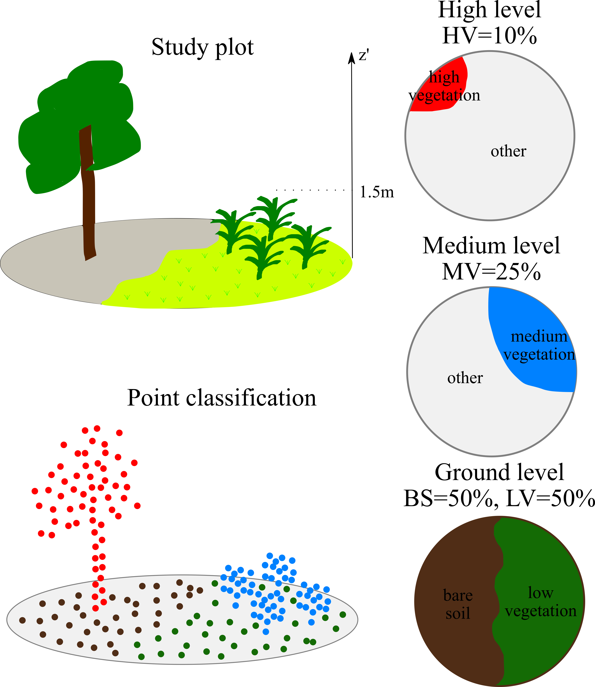

# PointNet-based model for the prediction of vegetation coverage using 3D LiDAR point clouds

PyTorch implementation of a weakly supervised algorithm for the prediction of vegetation coverage of different stratum. The algorithm is based on PointNet model [ref] for 3D data classification and segmentation.
First, our algorithm compute the pointwise-predictions a point belong to one of 4 classes:
- low vegetation
- bare soil
- medium vegetation
- high vegetation

Then it reprojects each point to the corresponding vegetation stratum by using posterior probabilities.
Finally, we compute vegetation ratio for each stratum to get final results.



### Example usage
We show how to use the code to reproduce the results in the notebook `notebook_demo.ipynb`. 
The notebook can also be directly run on [this google colab](https://colab.research.google.com/drive/1MoX46KhSgkyQ36uSi04OVJ3RVHw-SeDH#scrollTo=_jH5pCLHuAza).


## Installation

### Requirements
The `torch_prototypes` package requires an environment with PyTorch installed (only tested with version 1.7.0).
Module [torch_scatter](https://github.com/rusty1s/pytorch_scatter) is also required.
The installation of torch_scatter can be challenging, please, check your cuda version and carefully follow the instructions.

We save the results in GeoTIFF file

### Install 
We suppose that you already have pytorch installed.

# Install torch_scatter
Launch this code to check your TORCH and CUDA versions if you don't know them.
```python
import torch

def format_pytorch_version(version):
  return version.split('+')[0]

TORCH_version = torch.__version__
TORCH = format_pytorch_version(TORCH_version)

def format_cuda_version(version):
  return 'cu' + version.replace('.', '')

CUDA_version = torch.version.cuda
CUDA = format_cuda_version(CUDA_version)

print("TORCH")
print(TORCH)
print("CUDA")
print(CUDA)
```

Then replace {TORCH} and {CUDA} by the obtained values to install the packages:


`pip install torch-scatter     -f https://pytorch-geometric.com/whl/torch-{TORCH}+{CUDA}.html`

`pip install torch-sparse      -f https://pytorch-geometric.com/whl/torch-{TORCH}+{CUDA}.html`

`pip install torch-cluster     -f https://pytorch-geometric.com/whl/torch-{TORCH}+{CUDA}.html`

`pip install torch-spline-conv -f https://pytorch-geometric.com/whl/torch-{TORCH}+{CUDA}.html`

`pip install torch-geometric`


Please, use requirements.txt to install other packages by launching `python -m pip install -r requirements.txt`


## Code 
The code is launched from `main.py`.
It can be launched from IDE, as well as from console with precising the arguments. Please, check the code for different arguments or do `python main.py --help`.
